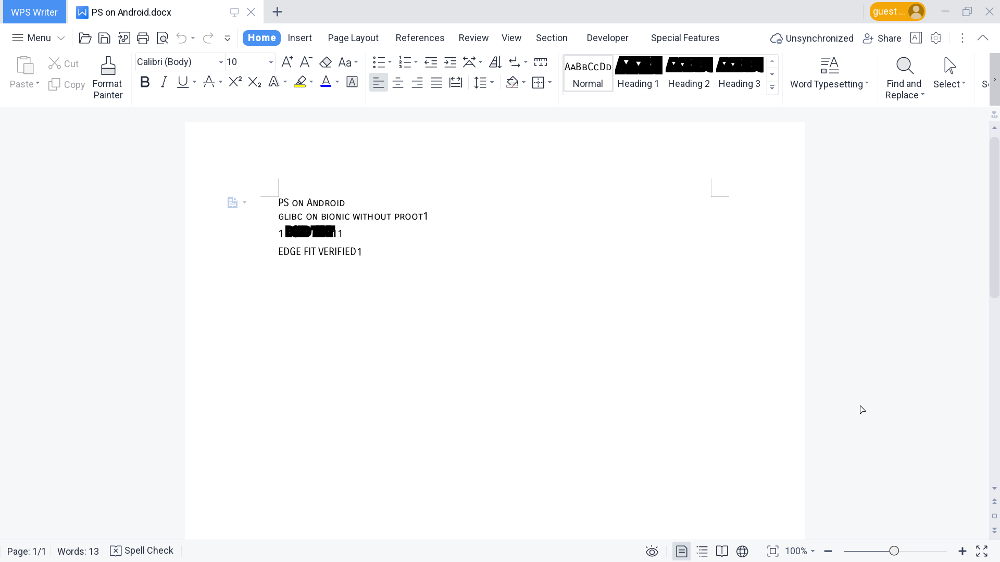

# BionicX

BionicX runs native AArch64 Linux programs built for glibc inside an ordinary
Android/Bionic application process, and renders X11 applications through an
X server embedded in the APK. It does not use PRoot, Termux, chroot, a VM, or
runtime syscall translation.

The first real application profile is WPS Office Writer. On a rooted Android
14 ARM64 test device, genuine WPS entered its main UI, opened, edited, and
saved a DOCX while running untraced under the BionicX app UID. Root was used
only to migrate the already-installed private POC files, not to run WPS.



## Architecture

```text
application profile (JSON)
  executable, loader mode, argv, environment, compatibility modules, DPI
                              |
                              v
Android/Bionic BionicXActivity ---- embedded Winlator-derived X server
              |                                  ^
              v                                  |
       bionicx-exec                         X11 Unix socket
              |                                  |
       glibc ld-linux -> glibc application -> libX11/libxcb
```

The repository separates four concerns:

- `native/executor`: generic Bionic-to-glibc `execve` handoff. A one-shot
  ptrace bootstrap handles the Android loader-entry stop and then detaches.
- `profiles` and `schemas`: declarative per-application launch configuration.
- `native/compat`: optional, narrowly scoped ABI/kernel compatibility modules.
  They are selected per profile and are not part of the core launcher.
- `android`: display/input/socket host based on Winlator's in-process X server.

See [the detailed architecture](docs/ARCHITECTURE.md) and
[compatibility boundaries](docs/COMPATIBILITY.md). The staged path from
controlled clients to Chrome and WPS is tracked in the
[integration test matrix](docs/TEST-MATRIX.md).

## Build

Requirements: Linux, Android SDK/NDK, JDK 17, Podman, Python 3, patchelf, and ADB.

```sh
tools/build.sh
examples/hello/build-bundle.sh

ANDROID_SERIAL=<serial> adb install -r build/bionicx-debug.apk
ANDROID_SERIAL=<serial> examples/hello/install-and-run.sh
ANDROID_SERIAL=<serial> examples/font-xft-probe/install-and-run.sh
ANDROID_SERIAL=<serial> examples/clipboard-x11-probe/install-and-run.sh
ANDROID_SERIAL=<serial> examples/keyboard-grab-x11-probe/install-and-run.sh
```

`tools/build.sh` does not download or bundle WPS. It builds the Bionic
executor with the Android NDK, builds the glibc WPS compatibility module in a
cross-build container, then builds the APK.

Integration clients use a content-addressed local builder image generated by
`tools/ensure-glibc-builder.sh`. The first build installs the AArch64 glibc/X11
cross-toolchain; later probe builds reuse it instead of repeating `apt` setup.
`tools/build-android-glibc.sh` also produces a content-addressed glibc 2.39
loader/libc/libm set from pinned GNU and termux-pacman sources. The probe bundle
builder installs this set over the Winlator-derived X11 dependency closure so
Android-blocked `set_robust_list` retains process-private owner-death recovery.
The Xft probe is the next controlled application: it packages open Liberation
fonts at build time and verifies real Fontconfig, FreeType, Xft, and XRender
glyph rendering before a proprietary desktop application is involved.
The clipboard probe opens two independent glibc/libX11 connections and verifies
the complete owner/request/property/notify protocol before WPS or Chrome is
used as the diagnostic surface.
The keyboard-grab probe uses three real Android-injected keys to verify
cross-client `GrabKeyboard`, `UngrabKeyboard`, owner-events routing, contention,
and disconnect cleanup.

## Add an application

1. Put the application beneath `files/apps/<profile-id>` and a compatible
   glibc runtime beneath `files/rootfs`.
2. Run `tools/resolve-elf-deps.py` against every entry ELF and plugin tree.
3. Add a profile conforming to `schemas/profile.schema.json`.
4. Prefer `loader` mode. Use `direct` only when the program needs its real
   `/proc/self/exe`, and relocate `PT_INTERP` to the app-private glibc loader.
5. Start with the abstract X11 socket. Use `filesystem` only for a client
   transport already patched to BionicX's private socket path.
6. Add a compatibility module only after identifying a concrete blocked
   syscall or missing FHS assumption.

The profile installer accepts independently prepared application and runtime
trees:

```sh
tools/install-profile.sh \
  --profile profiles/hello.json \
  --app-root build/hello-bundle/app \
  --runtime-root build/hello-bundle/rootfs \
  --serial <serial>
```

## WPS example

Read [the WPS profile documentation](examples/wps/README.md). For the original
POC device, `examples/wps/migrate-poc-device.sh` migrates its existing private
files to BionicX and relocates the equal-width Android package prefix.

The repository contains screenshots, hashes, and the device report under
`evidence/`; it deliberately contains no proprietary WPS binaries.

## Scope and safety

BionicX is currently an ARM64 research runtime, not a general Linux container.
Applications still see the Android kernel, app sandbox, seccomp policy, and
filesystem. Absolute FHS paths, D-Bus, audio, OpenGL, uncommon X11 extensions,
and 16 KiB page compatibility need application-specific verification.

Profiles and application bundles are trusted native code with the full rights
of the BionicX Android UID. Do not install untrusted bundles.

## License

The Android X server/renderer is derived from Winlator and remains LGPL-2.1.
See [LICENSE](LICENSE) and [NOTICE](NOTICE). WPS and runtime libraries retain
their own licenses and are not distributed here.
